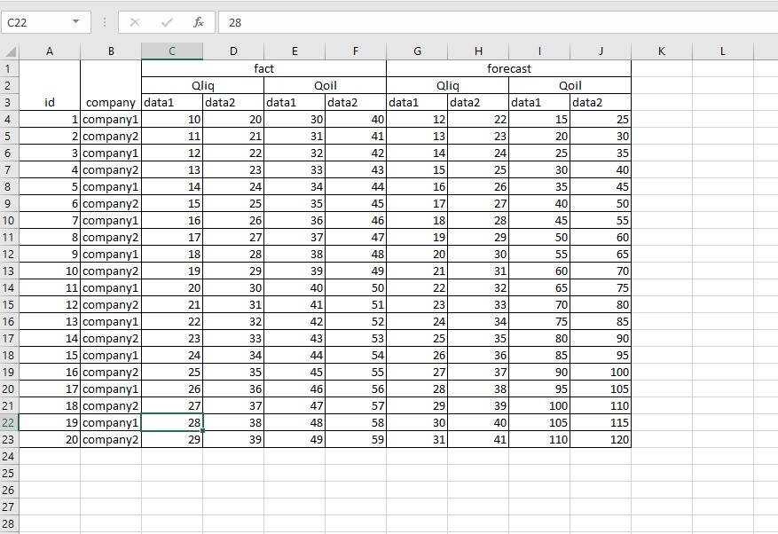
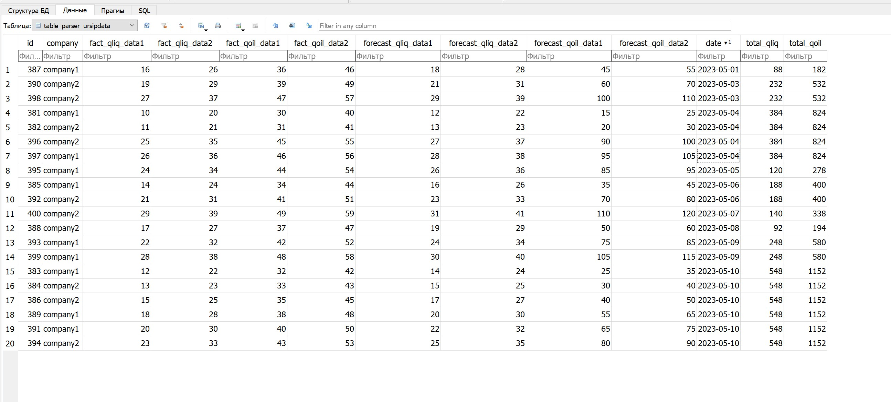

## Задача:

Создать парсер excel файла (во вложении) на Python.

Создать таблицу согласно нормам реляционных баз данных (внести все значения в одну таблицу)

Добавить расчетный тотал по Qoil, Qliq, сгруппированный по датам (даты можете указать свои, добавив программно, не
изменяя исходный файл, при условии, что дни будут разные, а месяц и год одинаковые)

1. Результат должен представлять готовое к использованию решение
2. Результат для проверки разместить на Github, предоставить ссылку
3. Просьба показать понимание принципов SOLID и практик связанных с этими принципами
4. В качестве БД можете использовать любую, например SQLite
5. Тестовое задание не ограничено по времени, можете взять несколько дней

## Решение:

На базе фреймворка Django реализован функционал парсинга файла и добавление результата в базу данных.

## Использование:

- Скрипт запускается в командной строке командой ```python manage.py parsexl```.

- По умолчанию местоположение файла относительно корня проекта находится в директории
  ```table_parser\data\table.xlsx```.

- При необходимости иное местоположение можно передать параметром --path относительно корня проекта.

- Пример: ```python manage.py parsexl --path=new_app\new_data\new_table.xlsx```

## Результат работы:

Готовая таблица в базе данных, согласно требованиям ТЗ

## Пример работы

Данные на вход excel файл:



Данные на выход:


